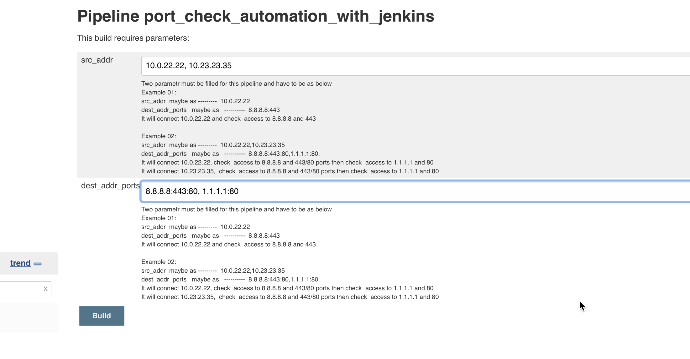
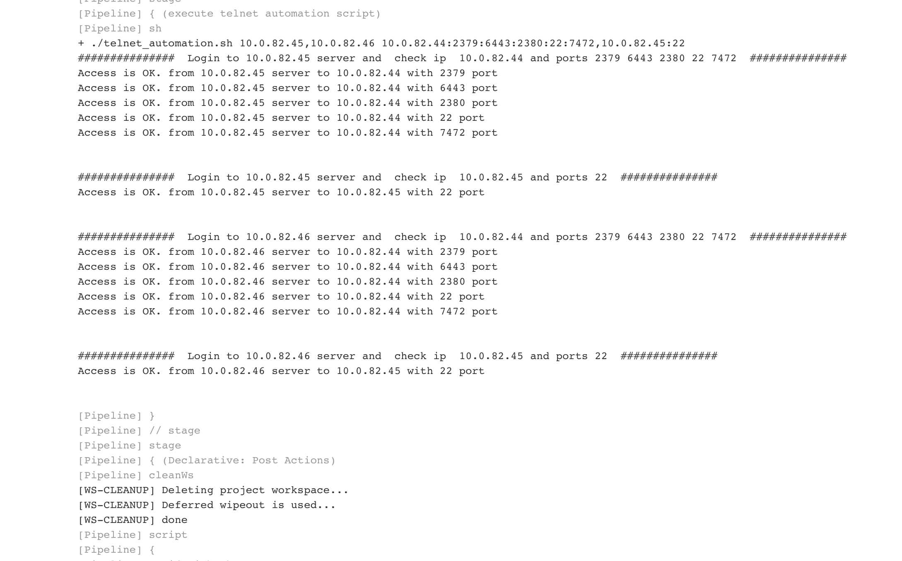

# Port Check Automation with Jenkins

###  Why do we need:
All the time developers, network engineers ask sys admin or devops engineer to check access to  destination ipaddr and port from specific server. This kind of activity is resource consuming. 

### How does it work:
You have to create parametrized pipeline job in Jenkins and send two parametrs to "port_check_automation.sh" script in Jenkinsfile. Jenkins/ansible server will login source server address with non-root user and passwordless authentication for checking destination ip addr and port. 

### Requirements: 
Create  user in source linux servers for just login purposes. User has to be  assigned permissions  to /dev/tcp , /usr/bin/getent and some other linux  builtin commands <br />
Jenkin server has to be passwordless login to source linux servers. It is security drawback but keep it this user only limited privileges or you can use another automation framework such as ansible<br />

### Manual usage example:
```
$ ./script.sh  src1 dst1:port1

Script which will accomplish specific task:
login src1 server and telnet dst1 port1

$ ./script.sh  src1 dst1:port1:port2:port3

Script which will accomplish specific task:
login src1 server and telnet dst1 port1
login src1 server and telnet dst1 port2
login src1 server and telnet dst1 port3

$ ./script.sh  src1,src2 dst1:port1:port2:port3,dst2:port1:port2
Script which will accomplish specific task:
login src1 server and telnet dst1 port1
login src1 server and telnet dst1 port2
login src1 server and telnet dst1 port3
login src1 server and telnet dst2 port1
login src2 server and telnet dst2 port2
```


### Parametrized job example


### Jenkins job output


Additionally, Jenkins admin can give access to developer or other people  for checking port by yourself.